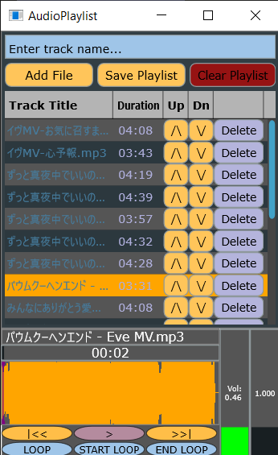

Personal project built from a school project and further improved, app not really resource efficient though.



# Building the JUCE Project

This project includes both `.jucer` and CMake versions.

## Option 1: Build with Projucer and Visual Studio

1. Install **Visual Studio** and **Projucer**.
2. Open the `.jucer` file in **Projucer**.
3. Export or open the project in **Visual Studio**.
4. Build the project in either **Debug** or **Release** mode.

## Option 2: Build with CMake

You can also build the project from the command line using CMake:

```bash
cmake -B build .
cmake --build build --config Debug
cmake --build build --config Release
```

The executable should appear in:

```text
build/OtoDecks_artefacts
```

## Using CMake in Visual Studio Code

Another option is to open the folder containing the `CMakeLists.txt` file in **Visual Studio Code** and use the CMake extension to manage the build.

Useful links:

- https://code.visualstudio.com/
- https://github.com/microsoft/vscode-cmake-tools

## Generating IDE Projects with CMake

CMake can also generate IDE project files.

### Visual Studio 2022

```bash
cmake -G "Visual Studio 17 2022" -B build .
```

Then open the generated `.sln` file in the `build` folder.

### Xcode

```bash
cmake -G "Xcode" -B build .
```

Then open the generated Xcode project in the `build` folder.

## Option 3: Download from Release

A prebuilt version can be downloaded from the **Releases** section of this repository.

1. Go to the **Releases** page.
2. Download the latest available build.
3. Extract the downloaded file `.zip` file. It should be a `.zip` file.
4. Run the `.exe` from the extracted folder.

## Building the FFmpeg Test Branch

To build this project, you need the **FFmpeg development package**, not just the normal runtime version.

Make sure your FFmpeg download includes these folders:

- `bin` – contains DLL files needed to run the app  
- `lib` – used during linking when compiling  
- `include` – contains header files for compilation  

A normal FFmpeg build (runtime only) will NOT work because it does not include the required development files.

### Setup

1. Download the FFmpeg development package  
2. Place it somewhere easy to access (e.g. `C:\ffmpeg`)  

3. Configure the project:
   - Set the **include path** to the `include` folder  
   - Set the **library path** to the `lib` folder  
   - Note: Paths in the Projucer/JUCER file may already exist, but they must be updated to match your local FFmpeg folder  

4. Add the `bin` folder to your system `PATH`

## Features

* **Audio Playback:** standard playback controls, including volume and speed adjustments.
* **Playlist System:** Supports adding and playing tracks via drag-and-drop and features a search filter for finding specific files.
* **A/B Looping:** set specific start and end points for looped playback.
* **State Persistence:** Automatically saves the playlist, user settings, and UI preferences (window positions/modes) across sessions.
* **FFmpeg Support (Experimental):** An optional branch that enables audio playback from `.mp4` and `.m4a` files.

## Known Issues

* **High CPU Usage:** The application is not yet optimized; CPU usage may increase significantly while the playlist is open.
* **Startup Time:** Launching the application may take very long to launch if a large playlist was saved from the previous session.
* **Testing:** The FFmpeg integration has only been tested with `.mp4`, `.m4a`, `.mp3`, and `.wav` formats.

## Disclaimer

The Projucer and Visual Studio has been used for this project on Win10.
The CMake version is included, but it has not been personally tested, so additional setup or adjustments may be required depending on the system and development environment.

This project was originally developed as a school project and later improved as a personal project. The released build may still have performance limitations and is not fully resource efficient.

Release build is not up to date with source code.

